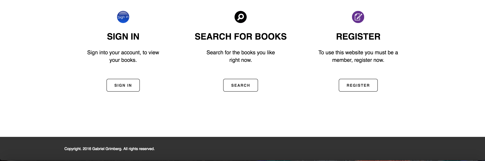
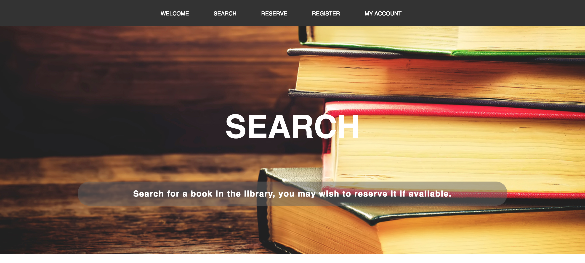
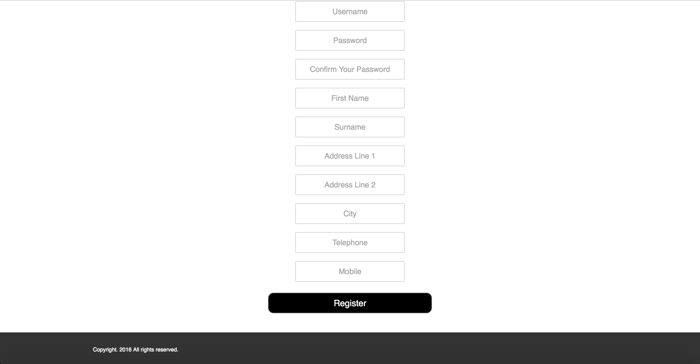

# Library Website

The aim of this assignment is to develop a book reservation web site using PHP and MySQL database. The application will allow users to search for and reserve library books.

## Video Demo Of The Website

### Screenshots Of The Website

#### Main Page

#### Search Page

#### Reservation Page

#### Login Page

#### Registration Page

#### Logout Page

