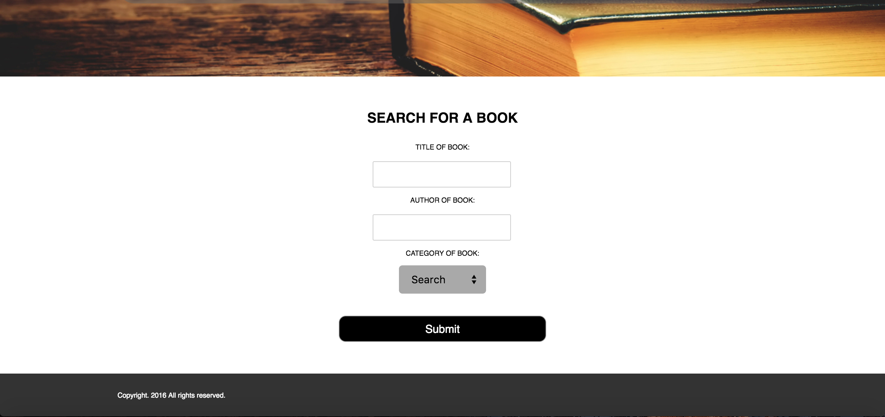
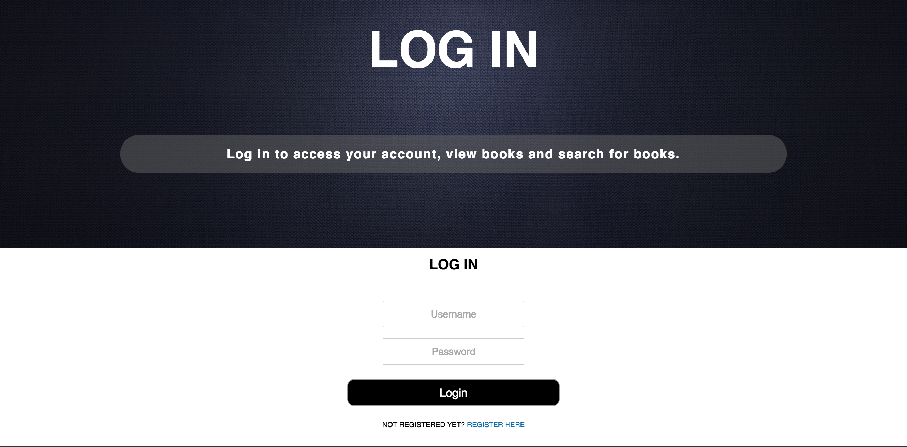

#Library Website

The aim of this assignment is to develop a book reservation web site using PHP and MySQL database. The application will allow users to search for and reserve library books.

## Screenshots Of The Website

### Main Page

### Search Page

### Reservation Page

### Login Page

### Registration Page

### Logout Page

